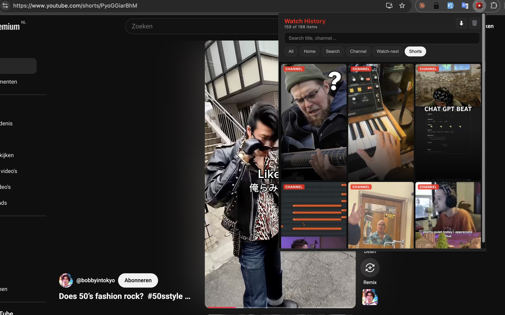

# YouTube Watch History Pro

Automatically logs every YouTube video you see — feed, search, channel, Shorts, watch-next sidebar — so you can find them later. 100% local, no tracking.

## What it does

YouTube's own history only records videos you *clicked on*. This extension logs every video that actually appeared in front of you — in the home feed, search results, on a creator's channel, as a watch-next suggestion, or while scrolling Shorts. No more "I swear I saw a video about X last week."

Browse YouTube normally. Click the extension icon to see the grid. Search by title or channel, filter by where the video came from, click a thumbnail to open it in a new tab.

## Features

- Automatic capture from home / search / channel / watch-next / Shorts / subscriptions
- Source badge on every tile — you can tell at a glance where each video came from
- Search by title or channel
- Filter by source (All / Home / Search / Channel / Watch-next / Shorts)
- Shorts rendered as 9:16 vertical tiles, long-form videos as 16:9
- Delete individual items or clear all
- JSON export of full history
- 100% local — no account, no server, no analytics

## Privacy

No data leaves your device. Ever.

All history is stored locally using `chrome.storage.local`. The extension makes zero outbound network requests. Uninstalling removes everything.

See [privacy-policy.md](./privacy-policy.md) for details.

## Install

Until the extension is live on the Chrome Web Store, you can load it manually:

1. Clone or download this repo
2. Open `chrome://extensions`
3. Enable "Developer mode"
4. Click "Load unpacked" → select this folder

## How it works

- `src/injector.js` runs at `document_start` on `youtube.com` and injects `src/interceptor.js` into the page's own JS context.
- `interceptor.js` does two things:
  1. Reads `window.ytInitialData` on DOM-ready and on every SPA navigation, extracting video entries from the embedded renderer tree.
  2. Monkey-patches `window.fetch` so continuation responses from `youtubei/v1/browse`, `/search`, `/next`, `/reel`, `/player` are also parsed.
- Parser in `src/lib/parser.js` walks the nested renderer tree and normalizes four shapes observed in real YouTube responses: `videoRenderer`, `gridVideoRenderer`, `lockupViewModel` (new watch-next shape), and `shortsLockupViewModel`.
- Service worker in `src/background.js` dedupes by `videoId`, caps at 10 000, writes to `chrome.storage.local`.

No bundler, no runtime dependencies. Plain JS. MV3. `npm test` runs Node's built-in test runner against three real captured ytInitialData fixtures (search results, channel page, watch page).

## Known limitations

YouTube's data shape evolves. The parser handles four renderer types observed on 2026-04-17, but YouTube may introduce new shapes over time. If detection breaks on a specific page, file an issue with the page URL.

The home feed on logged-out users is lazy-loaded and may return empty on first popup. Logged-in users get immediate results.

## Contributing

Issues and PRs welcome.

## License

MIT — see [LICENSE](./LICENSE).
